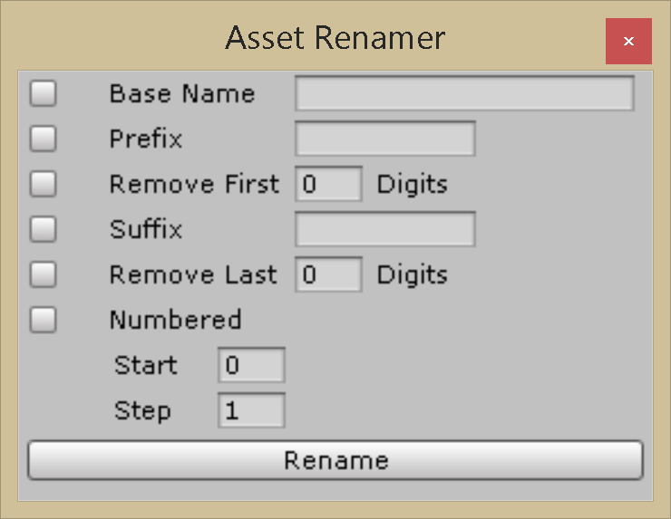
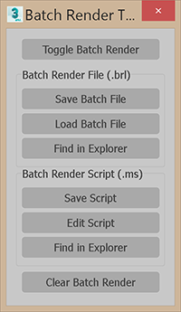

# C-Sharp
Sample C# Artist Editor Tools and Gameplay code for Unity3D 
These tools can be found in [../CSharp_Unity/Assets/Editor/](tree/master/CSharp_Unity/Assets/Editor)

## Asset_Renamer

Inspired by the **Rename Tool** in **3dsMax**. Used for batch renaming selected objects.

## FBX Mesh Import Post

Post Processor script for setting default import settings on all FBX files in the project. For this particular project we want materials to match scene materials in 3dsMax, rig to be configured as legacy and animations to be imported.

## FBX Mesh Import

On demand import settings similar to the above.  
With an **FBX** asset selected, go to ***CB_TOOLS>Import>Import FBX Mesh***

## FBX Anim Import

On demand clip generator for selected FBXs. Uses available **.csv** file of matching fbx name.
With an **FBX** asset selected, go to ***CB_TOOLS>Import FBX Animations***

**NOTE:** To generate an animation CSV file:
1. In 3dsMax, use the ***cb_batch_render_tools.ms*** script in your animation scene (script is located in [Samples](Samples/))
2. Press the **"Save Batch File"** button.
3. You an choose where to save the **.csv** file. The default path is the same as your scene file.
4. Copy the file next to your **FBX** inside your **Unity** project.
**Note:** In 3dsMax, you can press the **"Find in Explorer"** button in the tool to quickly find your **.csv** file.

## FBX Reset Anims

Bundled with the **FBX Anim Import** script is a second menu item to reset anims to the default, single **"Take 1"** anim clip.
With an **FBX** asset selected, go to ***CB_TOOLS>Import>Reset FBX Animations***
